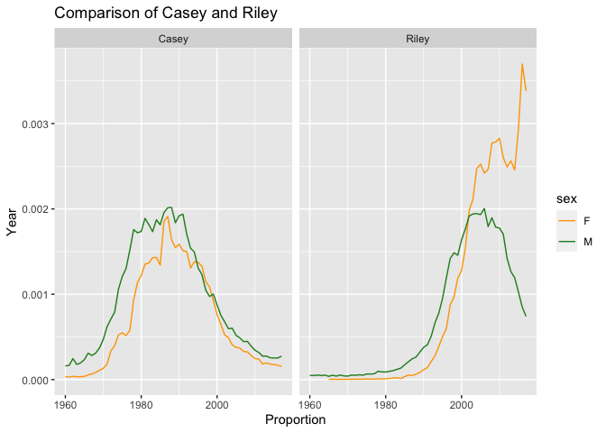

Untitled
================

## GitHub Documents

This is an R Markdown format used for publishing markdown documents to
GitHub. When you click the **Knit** button all R code chunks are run and
a markdown file (.md) suitable for publishing to GitHub is generated.

## Including Code

You can include R code in the document as follows:

``` r
library(ggplot2)
library(dplyr)
```

    ## 
    ## Attaching package: 'dplyr'

    ## The following objects are masked from 'package:stats':
    ## 
    ##     filter, lag

    ## The following objects are masked from 'package:base':
    ## 
    ##     intersect, setdiff, setequal, union

``` r
library(babynames)

library(babynames)
 babynames_riley_casey_1960_later <- babynames %>%
   filter(name %in% c("Riley", "Casey"), year >= 1960)
   babynames_riley_casey_1960_later
```

    ## # A tibble: 221 × 5
    ##     year sex   name      n      prop
    ##    <dbl> <chr> <chr> <int>     <dbl>
    ##  1  1960 F     Casey    76 0.0000365
    ##  2  1960 M     Casey   348 0.000161 
    ##  3  1960 M     Riley   108 0.0000499
    ##  4  1961 F     Casey    60 0.0000289
    ##  5  1961 M     Casey   359 0.000167 
    ##  6  1961 M     Riley   102 0.0000473
    ##  7  1962 F     Casey    79 0.0000390
    ##  8  1962 M     Casey   517 0.000246 
    ##  9  1962 M     Riley   112 0.0000533
    ## 10  1963 F     Casey    65 0.0000327
    ## # … with 211 more rows

## Including Plots

### This is the babynames plot from Problem set 4

``` r
ggplot(data = babynames_riley_casey_1960_later , mapping = aes(x = year, y = prop, color = sex )) +
  geom_line() +
  labs(title = "Comparison of Casey and Riley", x = "Proportion", y = "Year") +
  facet_wrap(~name) +
  scale_color_manual(values = c("orange", "forestgreen"))   
```

<!-- -->

Note that the `echo = FALSE` parameter was added to the code chunk to
prevent printing of the R code that generated the plot.
